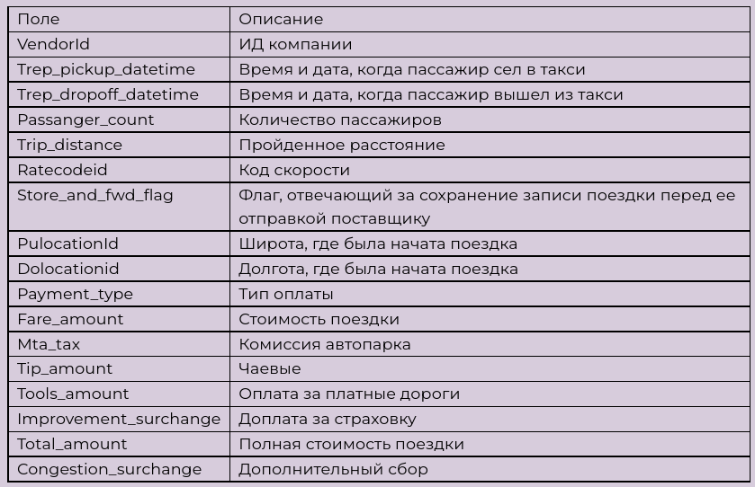
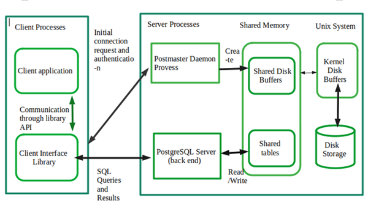
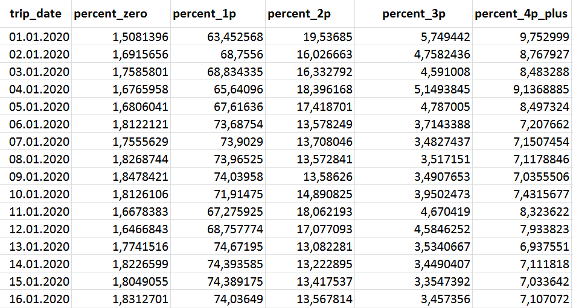
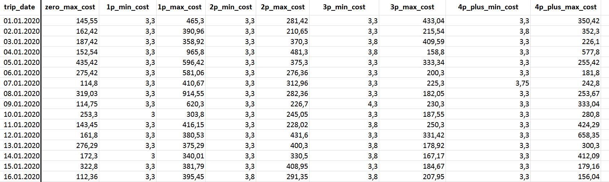
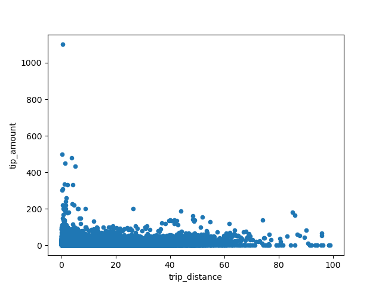
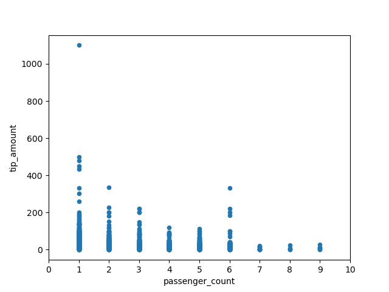

# Анализ поездок такси в Нью-Йорке

## Описание проекта с требованиями
Дана таблица, состоящая из поездок такси в Нью-Йорке.



Необходимо, используя таблицу поездок для каждого дня рассчитать процент поездок по количеству человек в машине (без пассажиров, 1, 2, 3, 4 и более пассажиров). Также добавить столбцы к предыдущим результатам с самой дорогой и самой дешевой поездкой для каждой группы.

По итогу должна получиться таблица с колонками date, percentage_zero, percentage_1p, percentage_2p, percentage_3p, percentage_4p_plus. Технологический стек – sql, scala (что-то одно).

**Дополнительно**: также провести аналитику и построить график на тему “как пройденное расстояние и количество пассажиров влияет на чаевые” в любом удобном инструменте.

## План реализации
Установить Ubuntu 20.03 локально.

Установить туда PostgreSQL 12.13.

Создать базу данных и таблицы.

Реализовать загрузку данных.

Очистить данные, провести анализ данных в таблице.

Провести аналитику и построить графики про чаевые.

## Используемые технологии с обоснованием
Технологический стек – СУБД PostgreSQL, Pandas. 

СУБД PostgreSQL - это популярная свободная объектно-реляционная система управления базами данных. 

Pandas -  высокоуровневая Python библиотека для анализа данных.Pandas используется только для дополнительного анализа.

В качестве файловой системы принято решение использовать обычную файловую систему. Нет смысла использовать озеро данных типа HDFS, потому что нет какого-то непрерывного потока файлов. Стоит задача загрузки одного файла, который содержит в себе данные за целый год.

## Схемы/архитектуры с обоснованием
Архитектура довольно простая: csv файл кладется  в локальную папку. Оттуда его берет PostgreSQL, после проводиться очистка и анализ данных. 





## Результаты разработки
В результате был создан проект со следующей структурой:

```bash

├── analysis                   # Jupyter notebook analysis
├── data                       # Data files
├── docs                       # Documentation files, presentations
├── images                     # Screenshots
├── cleanup                    # Data cleaning
├── import                     # Data import
├── src                        # Source files
└── README.md
```

В папке data лежат файлы с результатами обработки файла
[yellow_tripdata_2020-01.csv](https://disk.yandex.ru/d/DKeoopbGH1Ttuw)

Результатом является csv файл, который был импортирован в Excel таблицу.

<details>
  <summary>Пример результата обработки</summary>





</details>

Далее очищенные данные анализировались с помощью Pandas.

## Выводы
На основании графиков можно сделать следующие выводы:

1. Чем больше дистанция поездки, тем меньше чаевые. 


2.Чем больше пассажиров, тем меньше чаевых они оставляли. Больше всего оставляет один человек.



